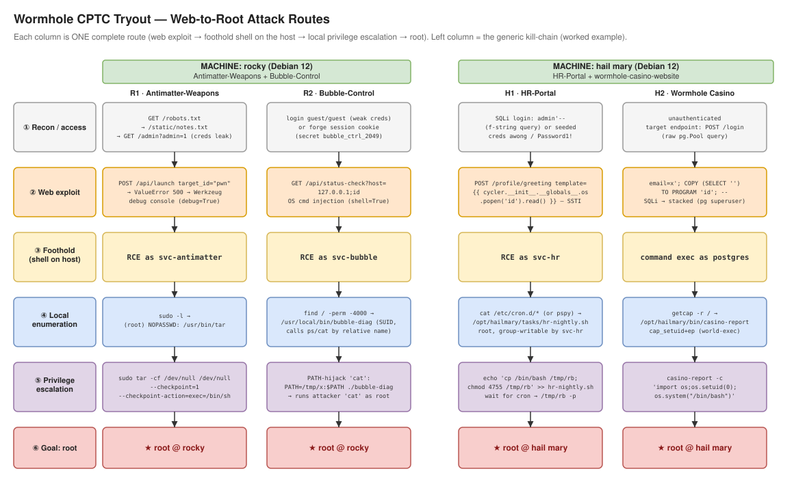

# CPTC-DEV — tryout web targets + setup tooling

This directory holds the four intentionally-vulnerable **websites** and the
tooling to stand up the two **tryout target VMs** (no Docker): copy everything to
the boxes, launch the sites, plant the local privilege-escalation vectors, and
create the login/root accounts.

Goal of the tryout: from the web, get a foothold on the box, then escalate to a
**root shell (`uid=0`)**. (There's no `root.txt` — being root is the win.)

## Contents

```
CPTC-DEV/
├─ Antimatter-Weapons/         # Flask site  (rocky)
├─ Bubble-Control/             # Flask site  (rocky)
├─ HR-Portal/                  # Flask site  (hail mary)
├─ wormhole-casino-website/    # SvelteKit + Postgres site (hail mary)
├─ ai-proxy/                   # off-box AI proxy for the casino's ORB-IT concierge
├─ linux-tryout-setup.sh       # THE box tool: launch sites, plant vectors, accounts, audit
├─ push-to-targets.sh / .ps1   # copy the tool + a machine's sites onto the VM over SSH
├─ ROUTES.md                   # full web-to-root attack chains (per machine)
└─ attack-flow.svg / .drawio.xml   # the routes as a flowchart
```

## Machines

| Machine | Distro | IP | Sites | Login (after `--accounts`) | Root (after `--accounts`) |
|---------|--------|----|-------|----------------------------|----------------------------|
| **rocky** | Debian 12 | `172.16.124.113` | Antimatter-Weapons, Bubble-Control | `rocky` / `DefaultPassword123!@#` | `root` / `very-sleepy-47` |
| **hail mary** | Debian 12 | `172.16.124.112` | HR-Portal, wormhole-casino | `hailmary` / `DefaultPassword123!@#` | `root` / `super-secret-password098` |

The freshly-imaged boxes start with a single login: **`user` / `bruh`**. Running
`linux-tryout-setup.sh --accounts` creates the machine login user and sets the
root password shown above.

---

## Quick start

### 1) Push the tool + that machine's sites onto the VM

Run from **this `CPTC-DEV/` directory** on your workstation. `user:bruh` is the
current SSH login on the fresh boxes (pass different creds as `user:pass`).

**Windows / PowerShell** (uses Posh-SSH, auto-installed):

```powershell
.\push-to-targets.ps1 rocky user:bruh        # -> 172.16.124.113 (antimatter + bubble)
.\push-to-targets.ps1 hailmary user:bruh     # -> 172.16.124.112 (hr + casino)
.\push-to-targets.ps1 user:bruh              # both machines
.\push-to-targets.ps1 rocky user:bruh -DryRun   # pack + show plan, no transfer
```

**Linux / WSL / macOS / Git-Bash** (uses `sshpass` if present, else one password prompt per host):

```bash
./push-to-targets.sh rocky user:bruh
./push-to-targets.sh hailmary user:bruh
./push-to-targets.sh user:bruh               # both
```

Either one drops onto the target's home:

```
~/linux-tryout-setup.sh      # the tool (executable)
~/cptc-src/<Site>/           # that machine's site source (node_modules/.git excluded)
```

### 2) On the box: set up the websites + privilege escalation

SSH in and run the tool. On a fresh box you are effectively root via the
`user`→root step of the image, or become root however the image allows, then:

```bash
# you are root, and the tool + ~/cptc-src are in /home/user
cd /home/user

# everything at once: accounts, priv-esc vectors, and launch the sites
./linux-tryout-setup.sh rocky     --accounts --privesc --launch
./linux-tryout-setup.sh hailmary  --accounts --privesc --launch
```

`--launch` defaults `--src` to `./cptc-src`, so you don't pass it. Order inside a
combined run is **accounts → privesc → launch**.

Do it in pieces if you prefer:

```bash
./linux-tryout-setup.sh rocky --accounts            # create rocky + root logins
./linux-tryout-setup.sh rocky --privesc             # plant the 2 escalation vectors
./linux-tryout-setup.sh rocky --launch              # start both rocky sites
./linux-tryout-setup.sh rocky --launch --app bubble # start just one site
./linux-tryout-setup.sh rocky --check               # verify the vectors are present
./linux-tryout-setup.sh rocky --stop-web            # stop the sites
```

> Notes: you are root, so **don't use `sudo`** and **don't use `~/cptc-src`**
> (as root `~` is `/root`). Run `./linux-tryout-setup.sh …` from `/home/user`
> (the default `--src` resolves next to the script). Re-push after any script
> change. The casino build needs internet (npm) and a couple of minutes.

### 3) Verify / audit

```bash
./linux-tryout-setup.sh rocky --audit    # report pre-existing insecurities to clean up
./linux-tryout-setup.sh rocky --check    # confirm the intended vectors are present
tail -f /var/log/cptc/<site>.log         # watch a site's server output
```

---

## The tool — `linux-tryout-setup.sh`

Run **as root** on the target. No args → interactive menu; or use flags:

| Flag | What it does |
|------|--------------|
| *(no args)* / `--menu` | ASCII-banner interactive menu (pick machine, then act) |
| `--audit` | Security baseline scan — report pre-existing insecurities |
| `--launch` / `--deploy` | Clone/copy + set up + **background** the site(s); `--src` defaults to `./cptc-src` |
| `--app <name[,name]>` | Select site(s): key (`antimatter` `bubble` `hr` `casino`), folder, or substring; `all` = every site. Implies `--launch` |
| `--privesc` | Plant the two escalation vectors for the machine (opt-in) |
| `--accounts` | Create the machine login user + set the root password |
| `--check` | Verify the escalation vectors are present |
| `--stop-web` | Stop the running site server(s) (all, or those named with `--app`) |
| `--tryout-wipe` | Sanitize the box for a fair run — wipe logs, shell history, the setup tool + docs, and scratch; **keeps** the vectors + running sites. Also self-deletes the tool. |
| `--list-apps` | List the four sites and their selector keys |
| `--src <dir\|git-url>` · `--src-subdir <d>` · `--deploy-dir <d>` | Source + install-dir overrides |

Backgrounding: each site is started detached with `nohup`; stdout/stderr →
`/var/log/cptc/<site>.log`, PID → `/run/cptc/<site>.pid`, so the tool never
blocks on a running server.

### Accounts (`--accounts`)

| Machine | Login user | Password | Root password |
|---------|-----------|----------|----------------|
| rocky | `rocky` | `DefaultPassword123!@#` | `very-sleepy-47` |
| hailmary | `hailmary` | `DefaultPassword123!@#` | `super-secret-password098` |

Usable over SSH only if `sshd_config` allows it (`PermitRootLogin` /
`PasswordAuthentication`) — the tool sets the passwords, it doesn't touch sshd.

### Sites, footholds, and vectors

| Machine | Site (port) | Runs as | Web foothold | Escalation vector |
|---------|-------------|---------|--------------|-------------------|
| rocky | `Antimatter-Weapons` :5000 | `svc-antimatter` | Werkzeug debug console | **A** sudo NOPASSWD `tar` |
| rocky | `Bubble-Control` :5001 | `svc-bubble` | OS command injection | **B** SUID PATH hijack `bubble-diag` |
| hailmary | `HR-Portal` :5000 | `svc-hr` | Jinja2 SSTI | **D** root cron (group-writable) |
| hailmary | `wormhole-casino-website` :6767 | `svc-casino` | SQLi → `COPY…TO PROGRAM` (as `postgres`) | **C** `cap_setuid` `casino-report` |

Each site launches with its real run command, all bound `0.0.0.0` (tested):
antimatter/bubble `python app.py` (bubble patched to :5001 to avoid a clash); hr
runs `seed.py` then `python app.py` (host patched `127.0.0.1`→`0.0.0.0`); casino
installs a local **PostgreSQL** (`wormhole`/`supernova` superuser + db), points
`.env` at `localhost`, `npm ci && npm run build`, `prisma db push`, `tsx seed.ts`,
then `node build`.

---

## Attack routes

The four web-to-root routes at a glance (each column = one full route):



- **`ROUTES.md`** — the two full web-to-root chains per machine (recon → web RCE →
  foothold → local enum → escalation), with exact commands and a remediation table.
- **`attack-flow.svg`** (above; source `attack-flow.drawio.xml`) — the same four
  routes as a colour-coded flowchart. On GitHub the SVG renders inline; open the
  `.drawio.xml` in diagrams.net to edit.

## Legal

Deliberately insecure training material. Keep the boxes on an isolated lab
network; only test systems you're authorized to assess.
